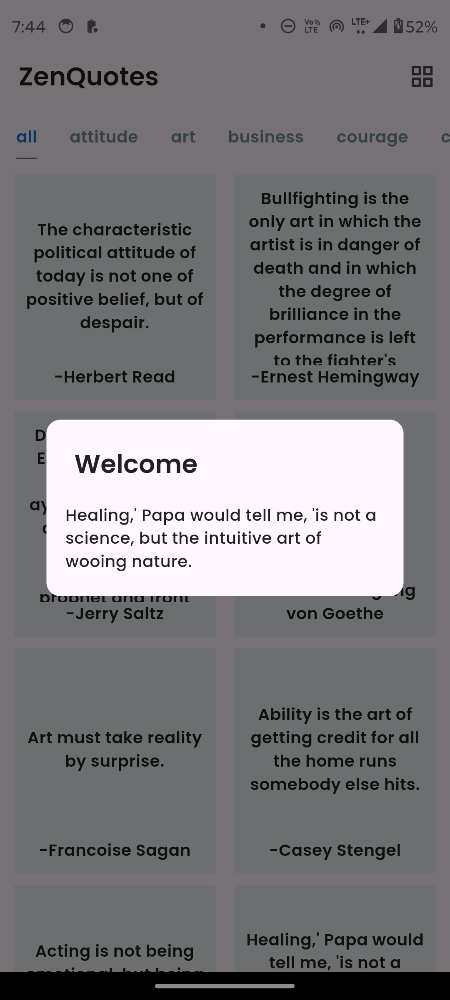
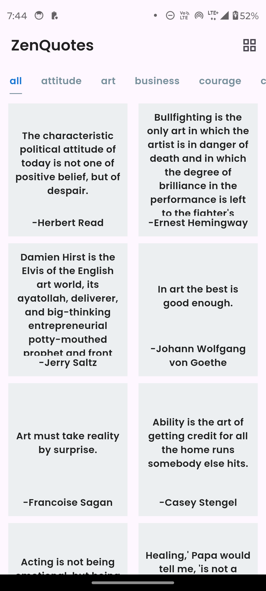
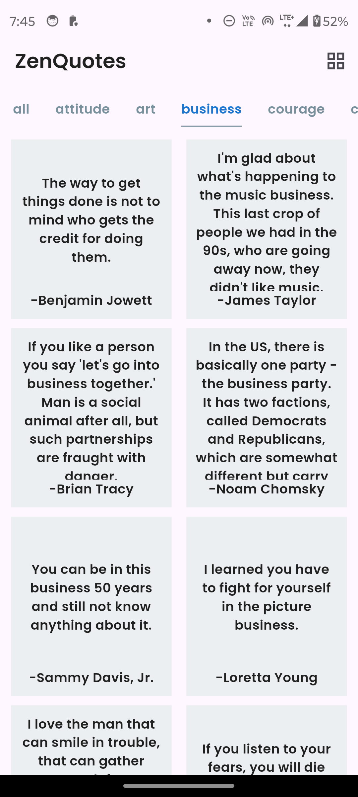
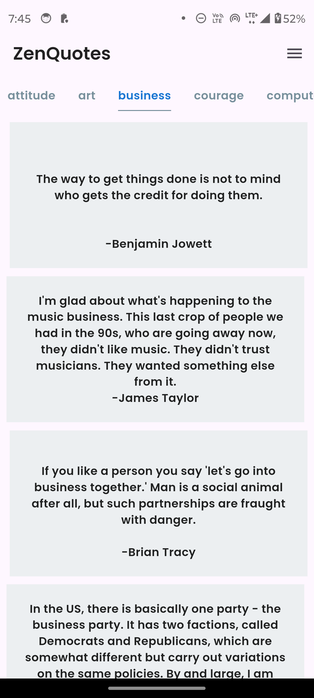
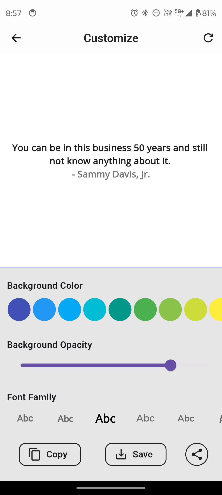
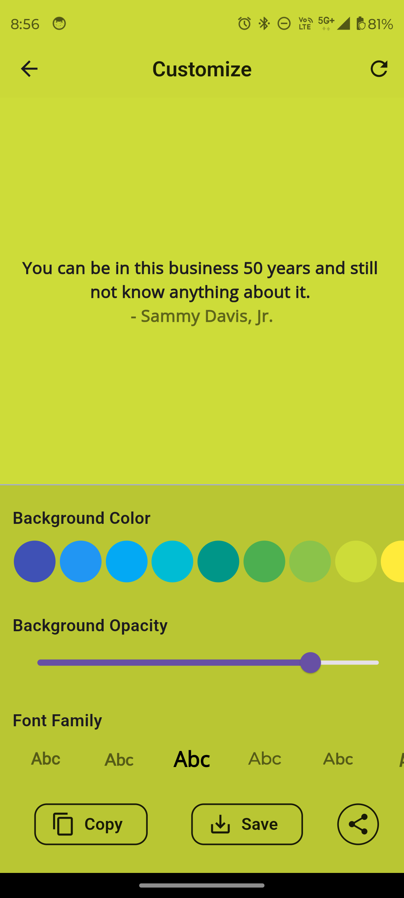
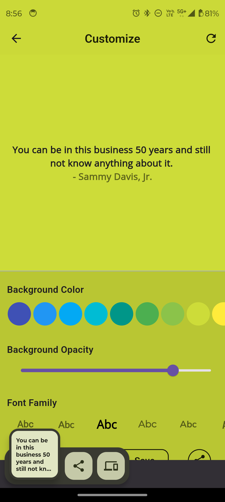
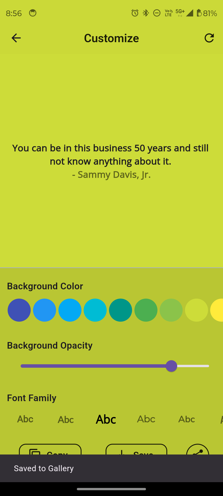
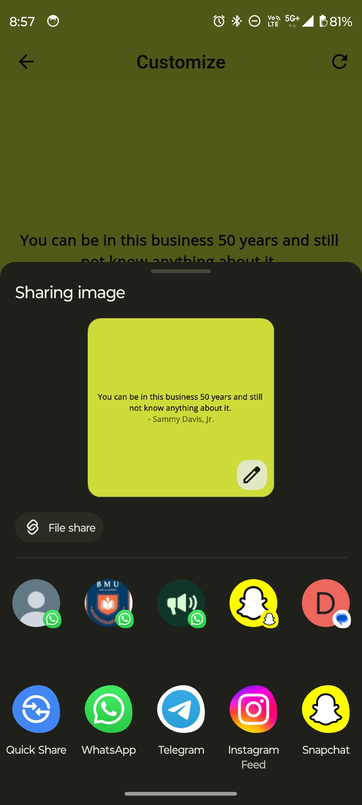
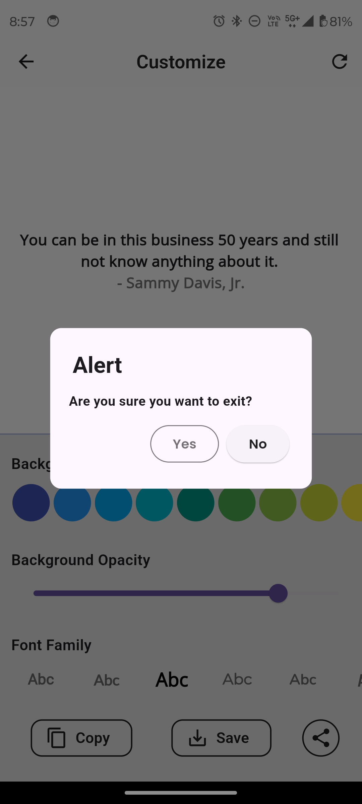

# ZenQuotes

A lightweight and intuitive app designed to inspire with quotes. The app offers seamless customization and sharing options, perfect for personalization enthusiasts.

## Features

### Core Functionality
- **Random Quote on Launch**: Displays a random quote in a dialog box every time the app starts.
- **Grid/List View Toggle**: Effortlessly switch between grid and list layouts to browse quotes as per your preference.
- **Quotes Categories Tab**: Filter quotes from the categories tab as per your mood and motivation. 

### Customization
- **Background & Opacity**: Change the background color and adjust the opacity of the screen for a personalized experience.
- **Font Styling**: Customize the font style of the displayed quotes to suit your aesthetic.

### User Actions
- **Save Quote**: Save the customized quote as an image in your gallery.
- **Copy Quote**: Copy the quote text directly to your clipboard for easy sharing.
- **Share Quote**: Share the customized quote image via third-party apps.
- **Reset Customization**: Refresh the screen to reset all customizations to default settings.

### Alerts
- **Exit Confirmation**: Displays an alert dialog when exiting the customization screen, asking users to confirm or discard changes.

---

## Screenshots

<table style="border-collapse: collapse; width: 100%;">
<tr>
<th colspan="4" style="text-align: center; border: 0;">Screenshots</th>
</tr>
<tr>
<td style="width: 250px; border: 0;">



</td>
<td style="width: 220px; border: 0;">



</td>
<td style="width: 220px; border: 0;">



</td>
<td style="width: 220px; border: 0;">



</td>

</tr>

<tr>
<td style="width: 250px; border: 0;">



</td>
<td style="width: 220px; border: 0;">



</td>
<td style="width: 220px; border: 0;">



</td>
<td style="width: 220px; border: 0;">



</td>

</tr>

<tr>
<td style="width: 250px; border: 0;">



</td>
<td style="width: 220px; border: 0;">




</tr>

</table>


---

## Installation

### Prerequisites
Ensure you have the following installed:
- Flutter SDK
- Dart

### Steps
1. Clone the repository:
   ```bash  
   git clone https://github.com/jagritixjha/ZenQuotes.git 
